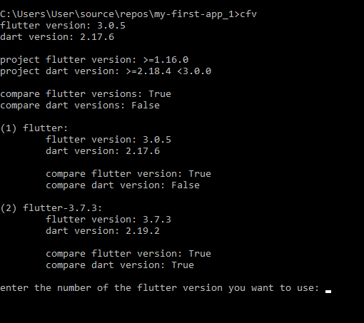

# change flutter version

tool that fixes the version bug of the flutter projects you cloned

## usage

1. download different versions of flutter that the project can run [like this](images/ss1.png)
2. copy it with a different name where flutter is installed
3. download the latest version from [releases](https://github.com/emresvd/change_flutter_version/releases/tag/v1.0)
4. unzip the file
5. add cfv.exe to environment variables
6. from the terminal go to the flutter project
7. run the `cfv` command   
